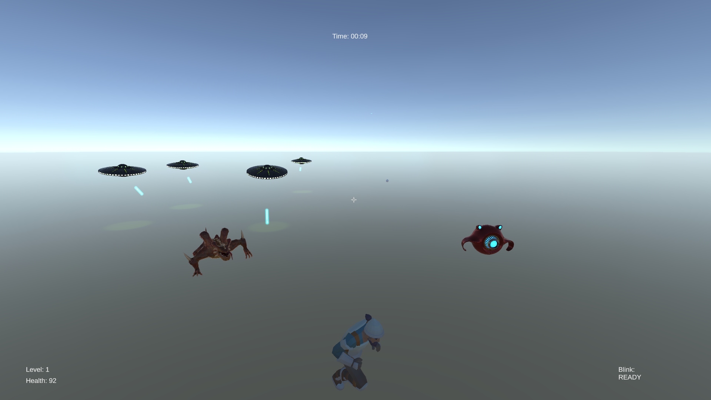
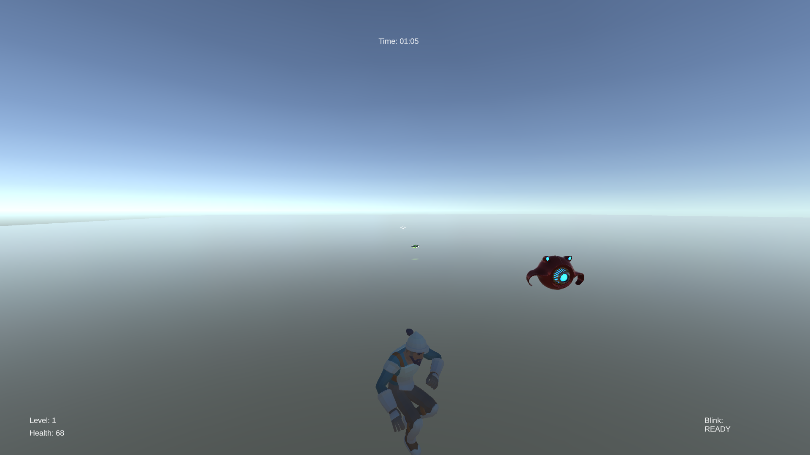
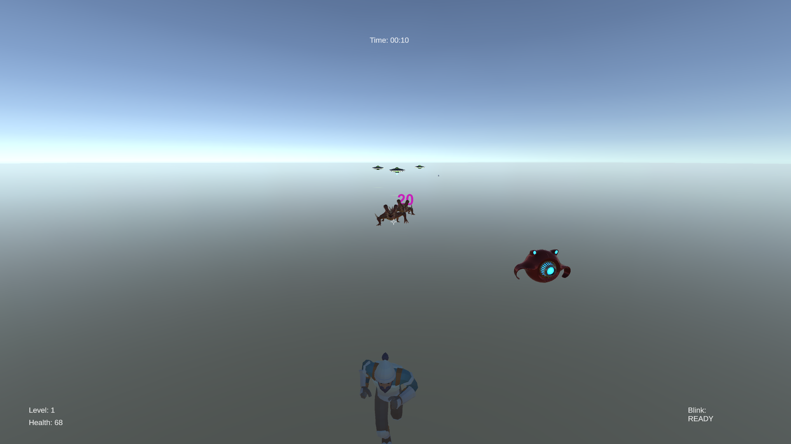
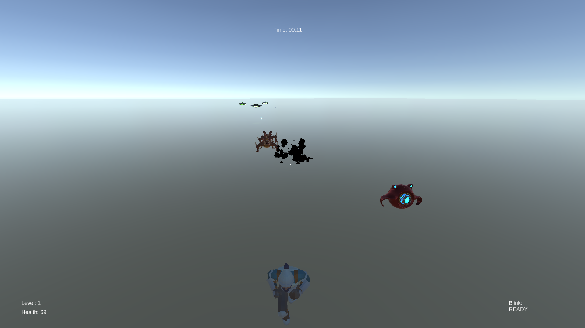
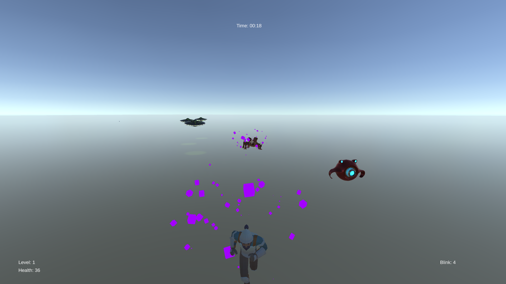

## Dungeon Crawl

### About the Project:

- This is a Rogue Like Game in which you have to survive as much as possible against increasing numbers of enemies which also become stronger by the second.
- The key to survive is to keep moving, use your jumps and dashes (blinks) as much as possible, and collect the power-ups dropped by the enemies.

### Used technologies:
1. [C#](https://learn.microsoft.com/en-us/dotnet/csharp/)
2. [Unity](https://unity.com/)
3. [Unity asset store](https://assetstore.unity.com/)

### Project Features:
- Increasing number of enemies
- Enemies increasing with power
- Level system which gives the player base stats
- Power-ups that drop from enemies which gives the player multipliers
- Power-ups are multiplicative and additive

### How to Run the Project?
1. Clone the [Repo](https://github.com/Spike01011/DungeonCrawl).
2. Open the project in Unity Editor version 2021.3.5f1.
3. Co to `Assets > Scenes`, grab the `SampleScene` and drag it into the `Hierarchy`.
4. Remove the `Untitled` scene from the Hierarchy.
5. Go to `File > Build Settings` or press `ctrl shift B`.
6. For the `Scenes in Build` make sure only `Scenes/SampleScene` is selected. Leave everything else as is.
7. Press Build. Select the Folder where you want the build to be.
8. Now whenever you want to play the game, go to the folder where the build is and double click `Roguelike5.exe`.

